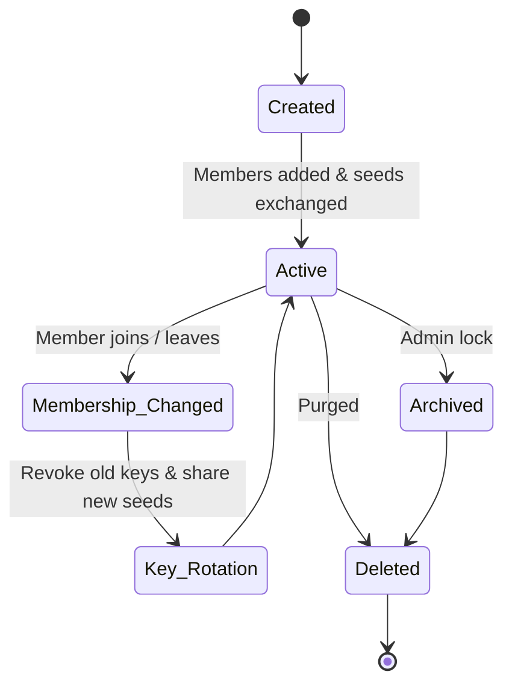

# RFC 0005: Multi-Party Group Messaging

```
Status: Draft
Version: 1.0.0
Author: DCP Core WG
Date: 2026-07-13
```

## 1. Introduction
This document specifies the application-layer Group Messaging protocol of DCP. It describes the group lifecycle, epoch tracking, Sender Keys cryptographic chains, and forward/backward secrecy enforcement.

---

## 2. Group Lifecycle State Machine

To coordinate group memberships and key rollouts, groups transition through six states:



### 2.1. Group Epoch Tracking
- Each group maintains a **Group Epoch** integer counter (initialized to 1).
- **Membership Event**: When a member is added or removed, the Group Epoch increments.
- **Key Rotation**: The epoch increment triggers an immediate **Sender Key Rotation**. The remaining group members discard all historical chain keys, derive new sender key seeds, and distribute them to the new membership list.

---

## 3. Sender Keys Cryptographic Protocol

To support large group chats efficiently, DCP utilizes the **Sender Keys** protocol instead of $N^2$ pairwise double ratchets.

### 3.1. Key Distribution Flow
1. **Setup**: When entering a group, each participant generates a **Sender Chain Key** (32 bytes) and a **Signature Key Pair** (Ed25519).
2. **Key Sharing**: The participant encrypts their Sender Chain Key and Ed25519 Public Key using pairwise Double Ratchet channels (RFC-0003) and distributes them to all other group members.
3. **Transmission**: When sending a group message, the sender:
   - Steps their Sender Chain Key using HMAC-SHA256 to derive a message key.
   - Encrypts the payload with AES-GCM-256.
   - Signs the ciphertext with their Ed25519 signature key.
   - Transmits the packet to the group relays.
4. **Receipt**: Recipients use the sender's cached chain key and public key to verify the signature and decrypt the message.

---

## 4. Message Ordering & Forward Secrecy

### 4.1. Message Headers & Sequence Numbers
Each group packet contains:
```json
{
  "group_id": "sha256_of_group_creation_payload_hex",
  "group_epoch": 4,
  "sender_id": "@alice.dcp.xxxx",
  "sequence_number": 42,
  "ciphertext": "aes_gcm_hex",
  "signature": "ed25519_sig_hex"
}
```
- **Ordering**: Recipients verify that the `sequence_number` is sequential for that sender. If a gap is detected, the client flags a missing packet.
- **Backward Secrecy**: New members receive the new sender seeds starting at the current epoch. They cannot decrypt previous messages since past epoch keys are discarded.
- **Forward Secrecy**: Evicted members do not receive the new sender seeds for the incremented epoch, preventing them from reading future messages.
