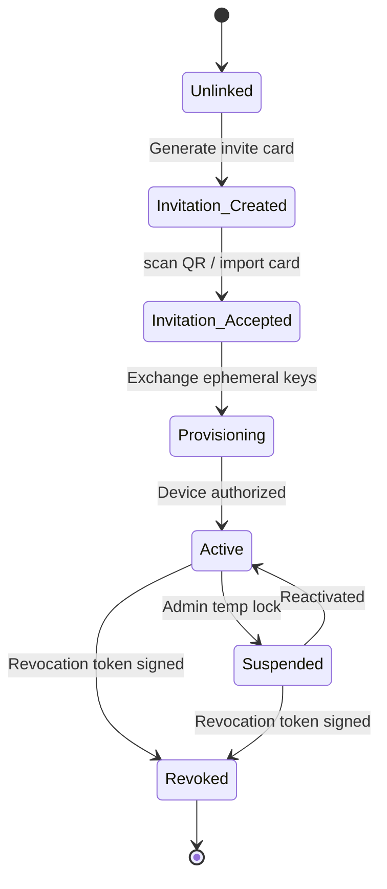

# RFC 0006: Multi-Device Synchronization

```
Status: Draft
Version: 1.0.0
Author: DCP Core WG
Date: 2026-07-13
```

## 1. Introduction
This document specifies the multi-device architecture of DCP. It describes the lifecycle of linked client devices, trust levels, permissions, and synchronization classes.

---

## 2. Device Lifecycle State Machine

Each device operating under a user's identity follows a strict state progression to ensure authorization, key rotation, and secure revocation.



### 2.1. State Definitions
- **Unlinked**: The device has generated keys but is not associated with a User ID.
- **Invitation Created**: A provisioned device creates a one-time invitation containing an ephemeral X25519 public key and signature challenge.
- **Invitation Accepted**: The secondary device imports the invite and sends its public keys.
- **Provisioning**: The parent device encrypts and transmits the initial identity card.
- **Active**: The secondary device is fully authorized to participate in the network.
- **Suspended**: The device is temporarily locked by the user (no syncing allowed).
- **Revoked**: The device's keys are permanently blacklisted and removed from the active circle.

---

## 3. Device Trust Levels & Permissions

To limit the blast radius if a secondary device is compromised, DCP implements granular trust tiers:

| Trust Level | Read Msg | Send Msg | Add Dev | Remove Dev | Export Id | Restore Backup |
|---|---|---|---|---|---|---|
| **Master Device** | Yes | Yes | Yes | Yes | Yes | Yes |
| **Phone** | Yes | Yes | Yes | Yes | No | Yes |
| **Desktop** | Yes | Yes | No | No | No | No |
| **Tablet** | Yes | Yes | No | No | No | No |
| **Temporary** | Yes | Yes | No | No | No | No |

---

## 4. Synchronization Classes (Sync Classes)

To prevent massive data dumps and save mobile battery/bandwidth, users toggle which data categories synchronize:

1. **Identity**: Linked device cards and master signatures.
2. **Contacts**: Friend lists, public keys, and preferred relays.
3. **Chats**: Double Ratchet session sequence states and message history.
4. **Groups**: Sender key registries and group memberships.
5. **Files**: Active transfer states and chunk resume indices.
6. **Preferences**: Theme, notification options, and local privacy levels.
