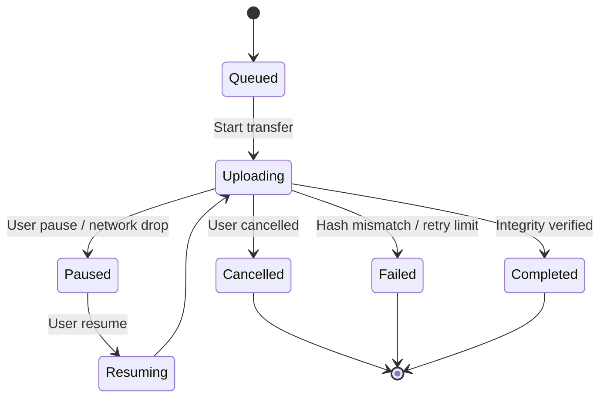

# RFC 0007: Secure File Transfer

```
Status: Draft
Version: 1.0.0
Author: DCP Core WG
Date: 2026-07-13
```

## 1. Introduction
This document specifies the application-layer Secure File Transfer protocol of DCP. It defines how files are chunked, encrypted, verified, paused, resumed, and transferred in parallel without exposing payload contents to intermediate relays or storage servers.

---

## 2. File Metadata Envelope & Key Sharing

Before transferring file chunks, the sender transmits an E2EE **File Metadata Packet** to the recipient over the Double Ratchet channel.

### 2.1. Metadata Envelope Payload
```json
{
  "transfer_id": "unique_transfer_uuid_hex",
  "file_name": "photo.jpg",
  "file_size": 1048576,
  "total_chunks": 4,
  "file_hash": "sha256_of_original_unencrypted_file_hex",
  "chunk_size": 262144,
  "chunk_hashes": [
    "sha256_of_chunk_0_ciphertext_hex",
    "sha256_of_chunk_1_ciphertext_hex",
    "sha256_of_chunk_2_ciphertext_hex",
    "sha256_of_chunk_3_ciphertext_hex"
  ],
  "encryption_key_id": "sha256_of_aes_key_hex",
  "encryption_key": "ephemeral_aes_gcm_256_key_hex"
}
```

---

## 3. Transfer State Machine

The client SDK and UI transition transfers through seven states to handle user controls and network events:



---

## 4. Chunk Verification, Resumability & Parallelism

### 4.1. 256KB Chunking & Verification
- Files are divided into chunks of exactly **256KB** ($262,144$ bytes), except the final chunk which may be smaller.
- Each chunk is encrypted using the ephemeral AES-GCM key.
- Recipient verifies each chunk independently:
  $$\text{Verified} = (\text{SHA-256}(\text{Chunk Ciphertext}) == \text{chunk\_hashes}[\text{index}])$$
- Chunks failing verification are discarded and re-requested.

### 4.2. Resumability
- If the transport link fails during a large file transfer, the recipient audits local chunks and returns a **Resume Invitation**:
  ```json
  {
    "action": "file_resume",
    "transfer_id": "unique_transfer_uuid_hex",
    "missing_chunks": [2, 3]
  }
  ```
- Senders immediately skip already acknowledged indices and resume transmission starting at the first index in `missing_chunks`.

### 4.3. Parallelism
- Clients can request multiple chunks concurrently (e.g. indices 0, 1, and 2 in parallel streams) over multiple onion circuits to maximize throughput.
- The recipient assembles the decrypted chunks in-memory or on-disk in order of their `Chunk Index`.
- Once all chunks are assembled, the recipient verifies the full file integrity:
  $$\text{SHA-256}(\text{Assembled Decrypted File}) == \text{file\_hash}$$
- If the final hash matches, the state changes to `Completed` and the file is written to the user's downloads folder.
