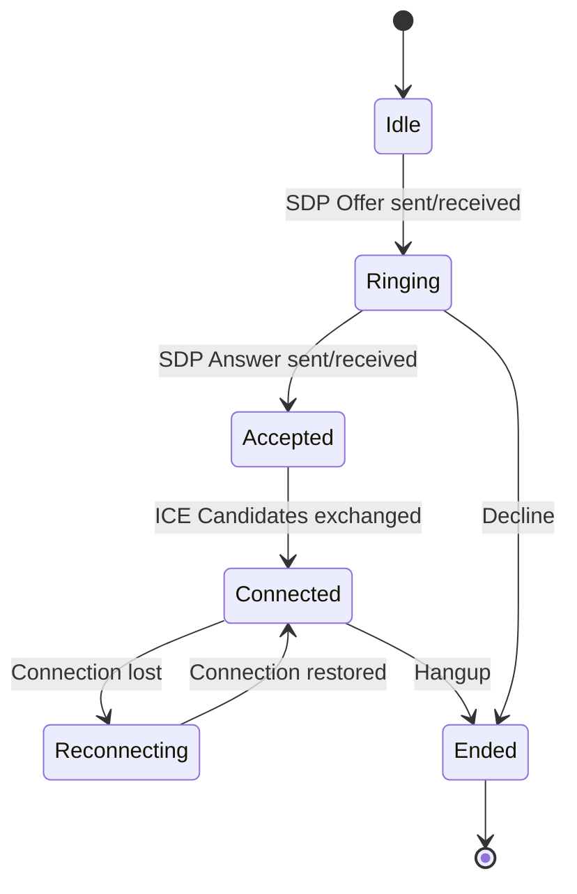

# RFC 0012: Voice & Video Signaling

```
Status: Draft
Version: 1.0.0
Author: DCP Core WG
Date: 2026-07-13
```

## 1. Introduction
This document specifies the WebRTC signaling broker and private availability protocol of DCP. It defines how calls are initiated, presence state levels are advertised privately, and typing indicators are exchanged ephemerally.

---

## 2. Call State Machine

To prevent media negotiation race conditions, client devices enforce a strict 6-state Call Machine:



### 2.1. Call Negotiation Signaling
All SDP offers, answers, and ICE candidate records are:
- Encrypted using the active pairwise Double Ratchet session (RFC-0003).
- Routed through the standard relay network.
- **Relay Role**: Relays act solely as signaling brokers. Audio/video media streams are routed directly peer-to-peer (P2P) using STUN/TURN traversal.

---

## 3. Presence Privacy Levels

To protect user metadata, presence is private-by-default. Users select one of four visibility profiles:

- **Invisible**: The user appears offline to everyone. No presence queries are answered.
- **Contacts Only**: Availability states are only visible to contacts in the user's whitelist.
- **Everybody**: Anyone on the network can query the user's presence.
- **Nobody**: Presence advertisement is fully deactivated (contacts receive cached states).

---

## 4. Ephemeral Typing Indicators

To prevent timing tracking and permanent logging, typing indicators are:
- **E2E Encrypted**: Sent over the Double Ratchet channel.
- **Ephemeral**: Relays route these immediately as transient packets. They are never stored in mailboxes.
- **Auto-Timeout**: Clients display typing status for a maximum of **5 seconds** from reception. If no subsequent typing update is received, the UI resets the state to idle.
